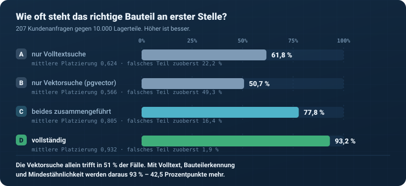
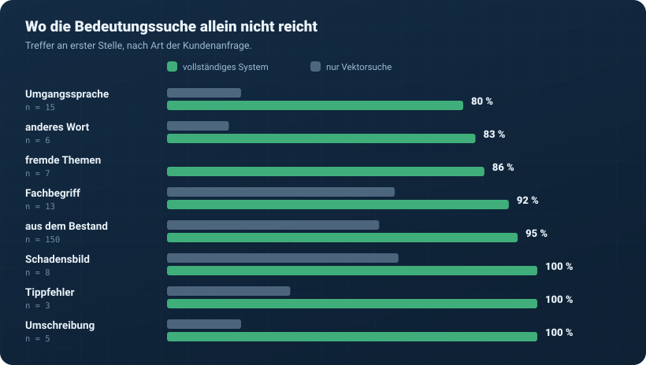
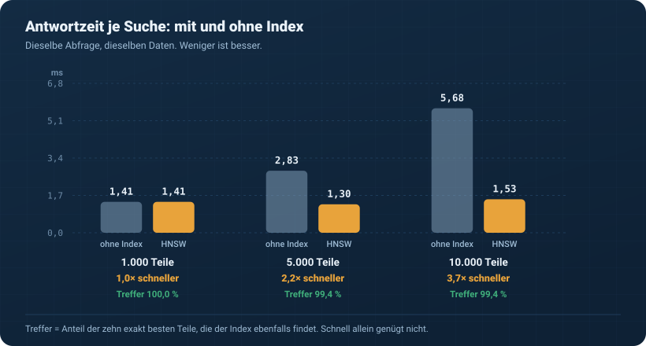
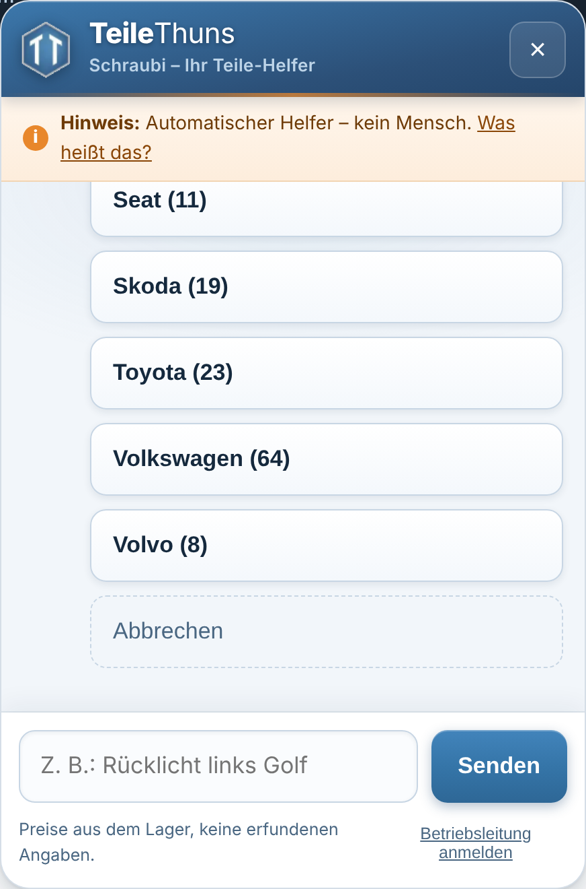
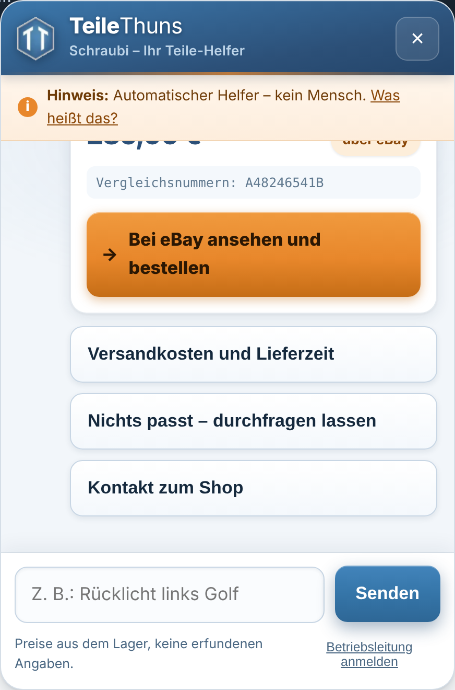
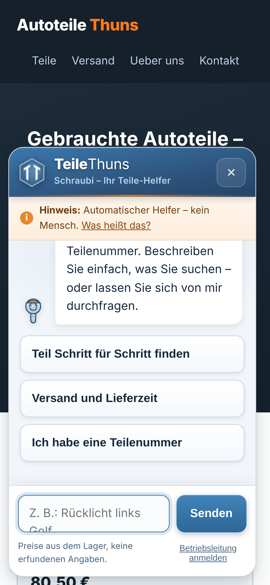

# Schraubi – Auskunftshelfer für einen Gebrauchtteile-Versandshop

[](https://github.com/DanielHuette/autoteile-chatbot-schraubi/actions/workflows/tests.yml)


Ein Chat-Assistent, der Kunden **ohne Teilenummer** zum richtigen
Autoteil führt. Gebaut für Menschen, die nicht mit Computern
aufgewachsen sind – und für einen Shop-Betreiber, der kein Fachmann ist.


---

## Das Problem

Ein Kunde, 72 Jahre alt, schreibt:

> „das rote Glas hinten links ist kaputt"

Eine **Volltextsuche** findet nichts: kein Wort stimmt mit
„Rückleuchte" überein.

Eine **Vektorsuche** findet etwas – oft eine Bremsscheibe für dasselbe
Fahrzeug. Die Marke stimmt, das Teil ist falsch. Für den Kunden heißt
das Rückversand und Ärger; für den Shop einen verlorenen Kauf.

Der Grund: Bei einem Ersatzteil müssen **zwei** Dinge gleichzeitig
stimmen – das Bauteil **und** das Fahrzeug. Ein Einbettungsmodell
gewichtet beides gleich. Ein Mensch nicht: Für ihn entscheidet zuerst
das Bauteil.

Genau das war beim Bauen messbar:



---

## Die Lösung

Vier Schichten, in dieser Reihenfolge. Jede löst ein anderes Problem.

| # | Schicht | Wofür |
|---|---|---|
| 1 | **Teilenummer exakt** | Wer eine Nummer nennt, weiß, was er will. Mit und ohne Bindestriche, Artikel- und Vergleichsnummern. Kein Raten. |
| 2 | **Bauteil und Fahrzeug erkennen** | Tippfehler ziehen, Umgangssprache in Fachbegriffe übersetzen, Bauteil / Marke / Modell / Lage bestimmen – aus dem **tatsächlichen Lagerbestand**, nicht aus einer gepflegten Liste. |
| 3 | **Zweifach suchen** | `pgvector` (HNSW, Kosinus) für Bedeutung, deutscher Volltext für Zeichen und Wortformen, Trigramm als Rückfall. Zusammengeführt per Reciprocal Rank Fusion. |
| 4 | **Mindestähnlichkeit** | Unterhalb der Schwelle: ehrliches „habe ich nicht". Sechs falsche Teile sind für einen Kunden schlechter als eine klare Fehlanzeige. |



> Die Pfeile laufen in Flussrichtung. Wer zusätzlich sehen will, wie die
> Kästen bei Mauskontakt aufleuchten, öffnet
> [`docs/architektur.html`](docs/architektur.html) im Browser – GitHub
> bindet Bilder als `` ein, und darin kommen keine Mausereignisse an.

### Warum keine freie Textantwort?

Der Helfer erzeugt **keinen** frei formulierten Text. Jede Antwort ist
eine feste Vorlage, in die geprüfte Werte aus der Datenbank eingesetzt
werden. Drei Gründe:

1. **Er kann nichts erfinden.** Keine erfundenen Preise, keine
   erfundenen Lieferzeiten, keine erfundenen Teilenummern. Bei
   Ersatzteilen kostet eine Halluzination echtes Geld.
2. **Prompt Injection ist nicht möglich**, weil es keinen Prompt gibt.
   Der Angriffsweg existiert schlicht nicht.
3. **Keine Kosten je Gespräch** und keine Abhängigkeit von einem
   fremden Dienst. Die Bedeutungssuche läuft auf dem eigenen Server.

Die Intelligenz steckt im **Verstehen**, nicht im Formulieren.

### Warum pgvector und nicht eine eigene Vektordatenbank?

Weil Suchvektor und Lagerbestand **dieselbe Zeile** betreffen:

```sql
SELECT title, price_cents, stock, on_ebay, ebay_url,
       1 - (embedding <=> %s::vector) AS aehnlichkeit
  FROM parts
 WHERE active AND stock > 0 AND brand = %s AND subcategory = %s
 ORDER BY embedding <=> %s::vector
 LIMIT 6;
```

Eine Abfrage liefert Ähnlichkeit, Preis, Bestand, Baujahrspanne und
eBay-Status – gefiltert, sortiert, konsistent. Mit einem getrennten
Vektorspeicher wären es zwei Systeme mit zwei Datenständen: Man sucht
Kennungen im einen, holt Stammdaten im zweiten, filtert nachträglich
in der Anwendung und erklärt dem Kunden, warum ein Teil angezeigt
wurde, das seit heute früh verkauft ist.

Dazu kommt: Der Betreiber betreibt ohnehin eine Datenbank. Ein zweites
System bedeutet zweimal Sicherung, zweimal Aktualisierung, zweimal
Ausfallrisiko – und das bei jemandem, der es nicht warten kann.

---

## Was gemessen wurde

Alles unter `bench/`, mit einem Befehl reproduzierbar. Die Diagramme
werden **aus den Messdateien erzeugt**, nicht von Hand gezeichnet – in
diesem Projekt kann keine Zahl stehen, die so nie gemessen wurde.

### Trefferqualität

Geprüft wird das **Bauteil**: Wer ein Rücklicht sucht, ist mit jedem
passenden Rücklicht bedient – aber nie mit einer Bremsscheibe.

Der Prüfkatalog besteht aus handgeschriebenen Fällen (Umgangssprache,
Umschreibungen, Schadensbilder, Tippfehler, Teilenummern) und aus
Anfragen, die automatisch aus dem echten Bestand erzeugt werden. Dazu
Anfragen, auf die es **nichts** geben darf – damit messbar wird, ob das
System auch schweigen kann.

<!-- MESSWERTE-QUALITAET -->
**207 Kundenanfragen gegen 10.000 Lagerteile.**

| Verfahren | Treffer Platz 1 | in den ersten 3 | mittlere Platzierung | falsches Teil zuoberst |
|---|---:|---:|---:|---:|
| nur Volltextsuche (PostgreSQL) | 61,8 % | 62,8 % | 0,624 | 22,2 % |
| nur Vektorsuche (pgvector, HNSW) | 50,7 % | 60,4 % | 0,566 | 49,3 % |
| beides zusammengeführt (RRF) | 77,8 % | 83,1 % | 0,805 | 16,4 % |
| **vollständig** (+ Bauteilerkennung, Schwelle) | **93,2 %** | 93,2 % | 0,932 | 1,9 % |

Die Vektorsuche allein trifft in 50,7 % der Fälle. Mit Volltext, Bauteilerkennung und Mindestähnlichkeit werden daraus **93,2 %** – 42,5 Prozentpunkte mehr. Entscheidender noch: Der Anteil, bei dem ein **falsches** Teil an erster Stelle steht, fällt von 49,3 % auf 1,9 %.

*Einbettungen: local, 384 Dimensionen. Reproduzierbar mit* `bench/qualitaet.py`.
<!-- /MESSWERTE-QUALITAET -->



Die interessante Zahl ist nicht die beste, sondern die schlechteste:
Die Vektorsuche allein trifft bei Umgangssprache und Umschreibungen
weit unter der Hälfte. Wer so ein System ohne Fachlogik ausliefert,
schickt älteren Kunden die falschen Teile.

### Antwortzeit und Index

<!-- MESSWERTE-LATENZ -->


| Lagergröße | ohne Index | mit HNSW | schneller | Trefferübereinstimmung | Indexgröße |
|---:|---:|---:|---:|---:|---:|
| 1.000 Teile | 1,41 ms | **1,41 ms** | 1,0× | 100,0 % | 2,0 MB |
| 5.000 Teile | 2,83 ms | **1,30 ms** | 2,2× | 99,4 % | 9,8 MB |
| 10.000 Teile | 5,68 ms | **1,53 ms** | 3,7× | 99,4 % | 19,5 MB |

*Mittelwert der Mitte (Median) je Einzelsuche, 16 verschiedene Suchtexte, 30 Wiederholungen, nach Warmlauf. Trefferübereinstimmung = Anteil der zehn exakt besten Teile, die der Index ebenfalls findet.*
<!-- /MESSWERTE-LATENZ -->

Gemessen wird nicht nur die Zeit, sondern auch die
**Trefferübereinstimmung mit der exakten Suche**. HNSW ist ein
Näherungsverfahren; eine Messreihe ohne diese Zahl wäre wertlos –
unendlich schnell und immer falsch ist leicht.

---

## Was der Helfer kann

### Klick-Interview für Kunden ohne jede Angabe

Marke → Modell → Baujahr → Bereich am Fahrzeug → Bauteil. Nur Knöpfe,
kein Tippen. Jede Auswahl kommt aus dem **tatsächlichen Bestand** mit
Stückzahl in Klammern – es gibt keine Auswahl, hinter der nichts liegt.
Jeder Schritt hat eine Hilfestellung („Das Baujahr steht im
Fahrzeugschein unter Feld B") und einen Zurück-Knopf.

| | |
|---|---|
|  |  |

### Laiensprache verstehen

| Der Kunde schreibt | Der Helfer sucht |
|---|---|
| „das rote Glas hinten links" | Rückleuchte, Lage links |
| „mein Auspufftopf ist durchgerostet" | Schalldämpfer |
| „der Winker vorne geht nicht" | Blinkleuchte, Lage vorne |
| „Rueklicht links" *(Tippfehler)* | Rückleuchte, Lage links |
| „Tacho zeigt nichts an" | Kombiinstrument |
| „1K6-945-095" | exakter Treffer über die Vergleichsnummer |


### Ehrlich sein, wenn etwas nicht passt

Findet der Helfer das Teil nur für ein anderes Modell oder eine andere
Seite, **sagt er das** – statt stillschweigend etwas Ähnliches
anzubieten:

> „Für dieses Modell habe ich das Teil nicht. Hier sind ähnliche Teile
> der Marke – ob sie passen, klären Sie am besten direkt mit dem Shop."

### Teile auf eBay weiterreichen

Liegt ein Teil auf dem eBay-Marktplatz des Shops, bekommt der Kunde
einen großen, deutlichen Knopf dorthin – keinen versteckten Link.



### Versand und Lieferzeit ab dem heutigen Tag

Gerechnet wird mit Bestellschluss, Wochenende und den Feiertagen in
Nordrhein-Westfalen. Wer Freitag um 17 Uhr bestellt, hört nicht „zwei
Tage". Schwere Teile werden als Speditionsgut erkannt – mit Aufschlag
und längerer Laufzeit.

### Getrennte Betriebsleitung

Der Shop-Betreiber meldet sich im selben Fenster an – über ein
**eigenes Passwortfeld**, nicht über den Chat. Das Passwort erscheint
daher weder im Verlauf noch in einem Protokoll. Danach läuft ein
getrennter Verlauf in eigener Farbe, der beim Abmelden verworfen wird.

| | |
|---|---|
|  |  |

Fragen wie „Umsatz heute", „Was sind die Bestseller im Monat?",
„Wie viel läuft über eBay?" – und die nützlichste:

> **„Welche Suchen hatten keine Treffer?"**
> Nachfrage, die der Bestand nicht deckt. Eine fertige Einkaufsliste,
> die nebenbei beim Betrieb entsteht.

### Fragt ein Kunde dasselbe, bekommt er nichts


Das ist **doppelt** abgesichert:

1. in der Anwendung über Schutzregeln,
2. in PostgreSQL über Rechte – die Rolle `teilethuns_chat` hat **kein
   Leserecht** auf die Verkaufstabelle:

```sql
GRANT SELECT ON parts, shipping_zones TO teilethuns_chat;
REVOKE ALL   ON sales                 FROM teilethuns_chat;
```

Selbst ein Programmierfehler könnte die Zahlen nicht herausgeben.

---

## EU-KI-Verordnung und Barrierefreiheit

**Offenlegung (Artikel 50)** – dreifach, nicht nur im Begrüßungssatz:
im ersten Satz, in einem dauerhaft sichtbaren Hinweisband und über den
Link „Was heißt das?", der Zweck, Arbeitsweise, Datenverarbeitung und
Grenzen erklärt (`GET /api/ki-hinweis`).

**Protokollierung (Artikel 12)** – jeder unvorhergesehene Fehler landet
in einer Datei, unabhängig von der Datenbank: Auch ein Datenbankausfall
bleibt nachlesbar.

**Einstufung** – kein Hochrisiko-System: Es entscheidet nichts über
Personen, bewertet niemanden und betrifft keinen Bereich aus Anhang III.

**Datenschutz** – gespeichert werden Art des Vorgangs, eine nicht
zurückrechenbare Sitzungskennung und erfolglose Suchbegriffe. Keine
Namen, keine E-Mail-Adressen, keine IP-Adressen, keine Cookies.
Löschung nach 90 Tagen, als Datenbankfunktion hinterlegt.

**Barrierefreiheit** (Barrierefreiheitsstärkungsgesetz, seit Juni 2025)
– 17 px Grundschrift, Knöpfe ab 48 px Höhe, Kontraste über der
Anforderung, vollständige Tastaturbedienung, Beschriftungen für
Vorlesesoftware, keine Zeitbegrenzung, Rücksicht auf
`prefers-reduced-motion` und `prefers-contrast`.

| Handy | |
|---|---|
|  | Dieselbe Bedienung auf dem Telefon: volle Breite, gleiche Schriftgröße, gleiche Knopfhöhe. |

---

## Einbau beim Betreiber

Eine Zeile vor `</body>`:

```html
<script src="https://ihre-adresse/widget.js" defer></script>
```

Mehr nicht. Kein Framework, keine zweite Datei, keine Änderung am
Shopsystem. Das Widget ist eine einzige JavaScript-Datei ohne
Abhängigkeiten; der Avatar ist als SVG eingebettet und wird nicht
nachgeladen.

Der tägliche Lagerabgleich läuft über `POST /api/sync`: CSV oder JSON,
deutsche oder englische Spaltennamen, Semikolon oder Komma. **Eine
fehlerhafte Zeile verwirft nicht die ganze Lieferung** – sie wird mit
Zeilennummer und Grund gemeldet, der Rest ist sofort im Bot. Neu
eingebettet wird nur, was sich tatsächlich geändert hat.

Die vollständige [**Betriebsanleitung**](BETRIEBSANLEITUNG.md) ist in
Alltagssprache geschrieben, mit Notfallplan, Antwortvorlage für
Beschwerden und Rechtsaufklärung.

---

## Technik

| Bereich | Wahl | Begründung |
|---|---|---|
| Datenbank | PostgreSQL 16 + pgvector 0.8 (HNSW) | Vektor und Lagerbestand in einer Zeile |
| Zweite Suchspalte | `tsvector`, deutsches Wörterbuch, als generierte Spalte | keine Pflege, nie veraltet |
| Rückfall | `pg_trgm` | starke Tippfehler |
| Server | FastAPI, Python 3.12 | typgeprüfte Schnittstellen, schlanker Betrieb |
| Einbettungen | mehrsprachiges Satzmodell auf eigenem Server (384 Dimensionen) | keine laufenden Kosten, keine Daten an Dritte |
| Oberfläche | reines JavaScript, eine Datei | ein `<script>`-Tag, nichts zu pflegen |
| Betrieb | Docker, `render.yaml` | eine Datei beschreibt den gesamten Betrieb |

Austauschbar sind die Einbettungen über eine gemeinsame Schnittstelle:
eigenes Modell, OpenAI, oder ein modellfreies Rückfallverfahren für
Tests und Notbetrieb.

---

## Selbst ausprobieren

```bash
git clone https://github.com/DanielHuette/autoteile-chatbot-schraubi
cd autoteile-chatbot-schraubi

pip install -r backend/requirements.txt

cp .env.example .env
python -m app.passwort_hash          # erzeugt alle drei Geheimnisse
# Werte in .env eintragen, DATABASE_URL auf eine PostgreSQL-16-Datenbank
# mit pgvector setzen (Neon, Supabase, Render oder eigener Server)

python scripts/einrichten.py --beispiele 400 --verkaeufe 900
python scripts/mitenv.py .env uvicorn app.main:app --app-dir backend
```

Danach `widget/demo.html` im Browser öffnen – eine Beispiel-Shopseite
mit eingebautem Helfer.

```bash
# Tests
python -m pytest tests/ -v

# Messreihen
python scripts/mitenv.py .env bench/qualitaet.py --teile 2000 --neu-aufbauen
python scripts/mitenv.py .env bench/latenz.py   --groessen 1000,10000
python bench/diagramme.py
```

---

## Tests

<!-- MESSWERTE-TESTS -->
**140 automatische Tests** in 8 Dateien, alle grün. Sie laufen bei jeder Änderung über GitHub Actions – zusammen mit der Stilprüfung und der Messreihe zur Trefferqualität.
<!-- /MESSWERTE-TESTS -->

Die Tests laufen gegen eine **echte** PostgreSQL-Datenbank mit
pgvector, nicht gegen einen Ersatz: Vektorabstand, deutscher Volltext,
generierte Spalten und Rechtevergabe lassen sich nicht nachbilden.

Geprüft wird unter anderem:

- dass eine Umsatzfrage als Kunde blockiert und als Betreiber
  beantwortet wird,
- dass das Passwort nicht im Gesprächsverlauf landet,
- dass die Chat-Rolle in der Datenbank kein Leserecht auf die
  Verkaufstabelle hat,
- dass eingeschleustes SQL wirkungslos bleibt,
- dass eine kaputte Zeile im Lagerabgleich nicht die ganze Lieferung
  verwirft,
- dass unverändertes Material nicht erneut eingebettet wird,
- dass Lieferzeiten Feiertage und Bestellschluss berücksichtigen,
- dass eine Störung keine internen Angaben preisgibt und protokolliert
  wird.

Dazu ein Oberflächentest, der das Widget im Browser durchspielt: Öffnen,
Klick-Interview, vage Suche, eBay-Knopf, Blockade, Anmeldung mit
falschem und richtigem Passwort, Abmeldung. Die Bildschirmfotos in
dieser Beschreibung entstehen dabei automatisch.

---

## Aufbau des Projekts

```
backend/app/
  config.py       Einstellungen; ohne Geheimnisse startet nichts
  db.py           Verbindungen, Schema, Fahrzeugkatalog
  embeddings.py   drei Anbieter hinter einer Schnittstelle
  vokabular.py    Umgangssprache, Lage, Baujahr, Tippfehler
  katalog.py      Bauteil und Fahrzeug aus dem echten Bestand erkennen
  search.py       Nummer, Vektor, Volltext, Trigramm, Zusammenführung
  dialog.py       Gesprächsführung und alle Antworttexte
  guardrails.py   was ein Kunde nicht erfahren darf
  auth.py         scrypt, signierte Sitzung, Fehlversuchsbremse
  kpi.py          Auskünfte für die Betriebsleitung
  shipping.py     Werktage, Feiertage, Bestellschluss, Sperrgut
  sync.py         täglicher Lagerabgleich
  main.py         HTTP-Schnittstellen
  schema.sql      Tabellen, Indizes, Rechtetrennung

widget/           das einbettbare Fenster (eine Datei) und eine Demoseite
bench/            Prüfkatalog, Messreihen, Diagrammerzeugung
tests/            automatische Tests
scripts/          Einrichtung, Umgebungsstarter, Hochladen
docs/             Bildschirmfotos, Grafiken, LinkedIn-Texte
```

---

## Was ich dabei gelernt habe

**Die Einbettung ist nicht die Lösung, sondern eine von vier Schichten.**
Semantische Ähnlichkeit allein trifft bei Ersatzteilen in der Hälfte der
Fälle daneben. Der Rest ist Fachlogik: Bauteil vor Fahrzeug,
Tippfehlerkorrektur, Mindestähnlichkeit.

**Die Schwelle ist eine Produktentscheidung, keine technische.** Ohne
sie liefert eine Ähnlichkeitssuche immer Treffer, auch bei „Pizza
Salami". Für einen 72-jährigen Kunden ist „habe ich nicht" mehr wert
als sechs falsche Teile.

**Ehrlichkeit über Lockerungen ist der teuerste Fehler, wenn sie
fehlt.** Die erste Fassung zeigte bei „Anlasser BMW 3er E46" einen
Anlasser für den 1er – ohne Hinweis. Das wäre ein zurückgeschicktes
Teil gewesen. Jetzt steht dabei, was aufgegeben werden musste.

**Produktionsbereit heißt nicht fehlerfrei, sondern vorbereitet.**
Was passiert bei einer kaputten Zeile im Lagerabgleich? Bei einem
Datenbankausfall? Bei einer Falschaussage gegenüber einem Kunden? Für
jeden dieser Fälle gibt es eine Antwort im Code und einen Abschnitt in
der Betriebsanleitung.

---

## Grenzen, offen gesagt

- **Geprüft mit erfundenen Lagerdaten.** Struktur und Größenordnung
  entsprechen einem echten Gebrauchtteilelager, die Teile selbst sind
  erzeugt. Mit echten Daten wären erneute Messungen nötig.
- **Keine eBay-Schnittstelle.** Die eBay-Kennzeichnung kommt aus dem
  Lagerabgleich. Eine direkte Anbindung an die eBay-Schnittstelle wäre
  der nächste Schritt.
- **Erstes Einbetten dauert.** Auf zwei Rechenkernen rund 0,14 Sekunden
  je Teil; 10.000 Teile also etwa 22 Minuten. Der tägliche Abgleich
  danach betrifft nur Geändertes und läuft in Sekunden.
- **Deutsche Antworten.** Das Einbettungsmodell ist mehrsprachig, die
  Antworttexte sind es nicht.
- **Mengenbremse im Arbeitsspeicher.** Für einen Shop dieser Größe
  ausreichend; bei mehreren Serverprozessen gehört sie nach Redis.

---

## Lizenz

MIT – siehe [LICENSE](LICENSE).

---

*Gebaut von [Daniel Hütte](https://github.com/DanielHuette). Fragen und
Anmerkungen gern als Issue.*
